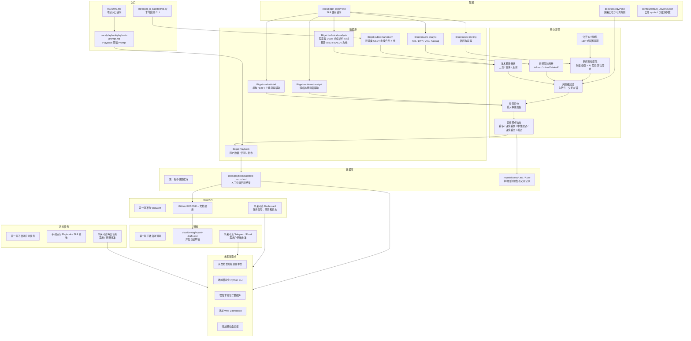

# Bitget Playbook AI 科技股策略需求文档

## 0. Skills 使用要求

写这份文档前已按要求使用：

1. `superpowers:brainstorming`
   - 已澄清赛道、工具优先级、策略方向、实现边界和安全边界。
2. `writing-requirements-docs`
   - 需求确认前只写需求文档和项目初始化文件；用户确认后进入本地回测实现阶段。
3. `superpowers:verification-before-completion`
   - 交付前检查文档结构、占位符、敏感信息、验收标准和 Git 状态。

## 1. 基本信息

- 需求名称：Bitget Playbook AI 科技股新闻情绪策略
- 所属项目：`/Users/ada/Documents/bitget ai`
- 文档状态：已确认，已进入本地回测实现阶段
- 需求来源：用户口述 + Bitget AI Base Camp Hackathon S1 官方规则
- 创建日期：2026-06-07
- 最近更新：2026-06-08

## 2. 背景

用户计划参加 Bitget AI Base Camp Hackathon S1 的美股 AI 交易赛道。用户的原始想法是：通过新闻和行情分析，决定美股相关资产什么时候买入、卖出或观望。

比赛要求 Demo 真实可运行，并能说清楚解决了谁的什么问题；美股 AI 交易赛道尤其关注是否围绕美股代币化交易场景解决真实问题，是否有可验证的回测或模拟交易记录，以及是否使用 Bitget 提供的美股相关数据或工具。

为了降低实现复杂度和安全风险，本轮优先使用 Bitget 现成能力，而不是从零搭建新闻爬虫、交易执行器或复杂 Web 产品。

本项目所说的“美股相关资产”，第一版特指 Bitget 已上线的股票类 USDT 永续合约 / stock futures / RWA 股票合约，例如 `NVDAUSDT`、`AAPLUSDT`、`MSFTUSDT` 等。它们不是传统美股现货，也不代表接入了全市场 NYSE / Nasdaq 原始现货行情。

## 3. 目标

1. 形成一个可参赛的最小方案：用 Bitget Playbook 创建、回测并发布一个 AI 科技股交易策略。
2. 策略主题聚焦 AI 科技股，例如 NVDA、MSFT、GOOGL、AMD、META 或 Playbook 支持的对应 Bitget 股票类 USDT 永续合约。
3. 策略性格为稳健型：新闻、宏观和趋势信号同向时才交易；信号冲突时优先观望。
4. 所有核心工具优先使用 Bitget 现成能力，尤其是 Bitget Playbook 和 Bitget Agent Hub 官方 skills。
5. 产出可用于提交和开发日记的材料：策略说明、回测指标、使用记录、公开展示文案草稿。

## 4. 非目标

1. 本轮不开发自定义交易执行引擎。
2. 本轮不接入真实资金下单。
3. 本轮不写入真实 Playbook API Key、Bitget API Key、secret、passphrase、私钥或真实账户敏感信息。
4. 本轮不自建新闻爬虫、行情数据库或复杂 Web UI。
5. 本轮不追求高频新闻抢跑；新闻源存在延迟时，策略仍按中低频稳健策略处理。
6. 本轮不承诺收益，不输出“保证赚钱”或直接投资建议。

## 5. 使用场景

| 场景 | 使用者 | 触发条件 | 预期结果 |
| --- | --- | --- | --- |
| 参赛策略创建 | 用户 | 用户拿到 Playbook API Key 后，希望生成一个参赛策略 | 通过 Playbook 创建 AI 科技股策略并生成可回测版本 |
| 策略回测 | 用户 | Playbook 策略创建完成后 | 得到 PnL、最大回撤、夏普比率等回测指标 |
| 策略说明 | 用户 / 评委 | 提交项目或录制演示视频时 | 能用 200 字以内讲清楚策略解决的问题、闭环和 Bitget 工具使用 |
| 开发日记 | 用户 / 社区 | 开发期间需要公开展示进展 | 在 X/Twitter 发布带 `#BitgetHackathon` 和 `@Bitget_AI` 的项目进展帖 |
| 安全检查 | 用户 / Codex | 需要提交 GitHub 仓库前 | 仓库不包含真实密钥、账户敏感信息或可直接实盘运行的完整策略 |

## 5.1 运行模式

本项目第一版只允许以下模式：

| 模式 | 是否第一版启用 | 说明 |
| --- | --- | --- |
| 文档模式 | 是 | 通过 README、需求文档、架构文档、策略文档和开发日记说明项目 |
| Playbook 回测模式 | 是 | 用户拿到 Playbook API Key 后，手动触发 Playbook 创建策略、回测和发布 |
| 本地公开数据回测模式 | 是 | 使用 Bitget 公开股票类 USDT 永续合约 K 线生成本地 backtest-only 报告 |
| 模拟 / 纸面记录模式 | 可选 | 只记录回测或模拟结果，不连接真实资金 |
| 自动通知模式 | 否 | 第一版不自动发 Telegram、Email 或其他通知 |
| 定时任务模式 | 否 | 第一版不启动任何后台定时任务 |
| 实盘交易模式 | 否 | 第一版不接真实资金、不自动下单、不自动调仓 |

## 5.2 Dry-run 与正式运行边界

- Dry-run / 文档验证：检查文档结构、策略口径、回测记录模板和提交材料，不访问真实账户，不触发交易。
- 本地公开数据回测：通过 `python3 -m bitget_ai_backtest.cli backtest` 拉取 Bitget 公开 K 线并生成本地报告；不使用 API Key，不读取账户，不下单。
- Playbook 回测：只使用 Playbook 平台进行策略生成、回测和发布；Key 由用户临时输入或安全环境变量提供，不写入仓库。
- 正式运行：本需求文档不定义实盘正式运行。若未来需要真实交易、定时任务、通知或 Web/API，必须另写需求文档和实施计划。

## 6. 功能范围

### 6.1 必须实现

1. 写清楚策略主题：AI 科技股新闻情绪 + 宏观风险 + 趋势确认。
2. 写清楚工具优先级：
   - Bitget Playbook 用于自然语言策略创建、上传、回测、发布和指标输出。
   - Bitget Agent Hub 官方 skills 用于辅助信号生成。
3. 写清楚第一版策略逻辑：
   - 新闻和产业叙事偏利好；
   - 宏观环境不明显 risk-off；
   - 技术趋势确认；
   - 三者同向时买入或加仓；
   - 任一关键信号冲突时观望或降低仓位。
4. 写清楚可提交证据：
   - Playbook 策略或 Demo 链接；
   - 回测指标；
   - 模拟交易或回测记录；
   - 项目说明；
   - 开发日记帖子链接。
5. 初始化 Git 仓库，便于后续上传 GitHub。

### 6.2 可以后置

1. 可视化网页 Demo。
2. 自动生成开发日记长文。
3. 多策略对比，例如稳健型、事件驱动型、激进型。
4. 更完整的 Agent Hub MCP 集成。
5. 视频演示脚本和录屏素材整理。

### 6.3 明确禁止

1. 禁止把真实密钥、API Key、私钥或账户敏感信息提交到 Git。
2. 禁止未经用户明确确认运行真实下单、自动调仓或后台交易任务。
3. 禁止为了比赛演示伪造回测结果、模拟交易记录或 API 调用记录。
4. 禁止把 Playbook 或 Agent Hub 未明确支持的能力写成已经实现。
5. 禁止把策略包装成投资建议或收益保证。

## 7. 脚本与系统架构草案

本项目第一版采用 Bitget Playbook 优先方案，并在用户确认需求后新增本地 backtest-only CLI。下图说明当前脚本化边界和未来如果继续产品化时应如何拆层；它不代表当前要启动数据库、Web/API、通知或定时任务。



### 7.1 架构拆分说明

| 层级 | 第一版职责 | 当前状态 | 后续改造边界 |
| --- | --- | --- | --- |
| 入口 | README、Playbook Prompt、本地回测 CLI | 已有文档 + CLI | 不做自动后台任务 |
| 配置 | 用策略文档、skill 文档和 `configs/default_universe.json` 记录可调口径 | 已有文档 + JSON 配置 | 不写真实密钥，不写实盘配置 |
| 数据源 | 优先使用 Bitget Playbook、Agent Hub 官方 skills、Bitget 公开行情 API | 已实现公开 K 线回测 | 不自建新闻爬虫 |
| 数据库 | 第一版不建库，只记录回测结果 | 已生成 `reports/` 报告 | 可后置 SQLite |
| 核心流程 | 公开 K 线收集、风控过滤、打分、五档观点、本地回测 | 已有本地 backtest-only 实现 | 不接实盘 |
| Web/API | 第一版用 GitHub 文档展示 | 不实现服务 | Dashboard 后置 |
| 通知 | 第一版只准备开发日记草稿 | 不自动发送 | Telegram/Email 需明确批准 |
| 定时任务 | 第一版手动触发 | 不启动后台任务 | 每日自动任务需明确批准 |
| 未来改造点 | 记录脚本化和产品化方向 | 仅规划 | 每一步都需独立需求确认 |

### 7.2 分层架构树

第一版以文档、Bitget Playbook 和本地 backtest-only CLI 为主，不开发前端、后端 API 或真实交易执行器。下面这棵树说明当前职责分层。

```text
┌─── 表示层 (Presentation Layer)
│    ├── GitHub README 展示
│    ├── 需求文档与架构文档
│    ├── 开发日记与 Showcase 材料
│    └── 未来可选 Web Dashboard
│
├─── 策略编排层 (Strategy Orchestration Layer)
│    ├── 策略管理器 (StrategyManager)
│    │    └── 维护 AI 科技股策略口径、候选池和版本
│    ├── 信号编排器 (SignalOrchestrator)
│    │    └── 汇总新闻、宏观、技术、情绪和市场情报
│    ├── 风险控制器 (RiskController)
│    │    └── 先做硬过滤，优先防亏和少犯大错
│    ├── 决策输出器 (DecisionOutput)
│    │    └── 输出看多 / 谨慎看多 / 中性观望 / 谨慎看空 / 看空
│    └── Playbook Prompt 管理器 (PlaybookPromptManager)
│         └── 生成给 Bitget Playbook 使用的自然语言策略说明
│
├─── Bitget 工具服务层 (Bitget Service Layer)
│    ├── PlaybookService
│    │    └── 策略创建、上传、回测、发布和指标输出
│    ├── NewsBriefingService
│    │    └── 使用 news-briefing 收集财报/指引、AI 芯片和算力需求新闻
│    ├── MacroAnalystService
│    │    └── 使用 macro-analyst 判断 Fed、利率、DXY、VIX、Nasdaq 环境
│    ├── TechnicalAnalysisService
│    │    └── 使用 technical-analysis 判断趋势、均线、RSI、MACD 等
│    ├── SentimentAnalystService
│    │    └── 使用 sentiment-analyst 做情绪和拥挤度辅助判断
│    └── MarketIntelService
│         └── 使用 market-intel 做机构、ETF 和主题叙事辅助判断
│
├─── 数据与记录层 (Data & Record Layer)
│    ├── BacktestRecord
│    │    └── 记录策略版本、标的、周期、PnL、最大回撤、夏普比率和截图
│    ├── SignalSnapshot
│    │    └── 未来可选记录每日信号快照
│    ├── DevlogRecord
│    │    └── 记录 X/Twitter 开发日记草稿和链接
│    └── ConfigRecord
│         └── 只记录占位说明，不记录真实 API Key 或账户敏感信息
│
└─── 基础设施层 (Infrastructure Layer)
     ├── 安全边界 (SecretsPolicy)
     │    └── 禁止密钥、私钥、真实账户敏感信息入库
     ├── 日志与复盘 (SessionRecap)
     │    └── 记录脱敏 AI 会话复盘
     ├── 监控与验证 (VerificationChecklist)
     │    └── 提交前检查占位符、敏感信息和回测证据
     ├── 定时任务边界 (SchedulerBoundary)
     │    └── 第一版不启动定时任务；未来必须单独确认
     └── 未来依赖管理 (FutureDependencyPlan)
          └── 如需 SQLite、Web/API、通知或定时任务，再单独写实施计划
```

### 7.3 第一版文件夹排列

第一版已在确认需求后新增本地回测代码。下面是当前 GitHub 仓库结构：

```text
bitget-ai/
├── AGENTS.md
├── README.md
├── .gitignore
├── pyproject.toml
│
├── configs/
│   └── default_universe.json
│
├── src/
│   └── bitget_ai_backtest/
│       ├── cli.py
│       ├── config.py
│       ├── bitget_client.py
│       ├── indicators.py
│       ├── strategy.py
│       ├── backtester.py
│       ├── reporting.py
│       └── models.py
│
├── tests/
│   ├── fixtures/
│   └── test_*.py
│
├── reports/
│   ├── local-demo/
│   └── latest/
│
└── docs/
    ├── requirements/
    │   └── 2026-06-07-bitget-playbook-ai-tech-stock-strategy.md
    │
    ├── architecture/
    │   ├── system-architecture.md
    │   ├── folder-structure.md
    │   ├── data-flow.md
    │   └── failure-premortem.md
    │
    ├── bitget-skills/
    │   ├── README.md
    │   ├── news-briefing.md
    │   ├── macro-analyst.md
    │   ├── technical-analysis.md
    │   ├── sentiment-analyst.md
    │   └── market-intel.md
    │
    ├── strategy/
    │   ├── README.md
    │   ├── trading-strategy.md
    │   ├── signal-scoring.md
    │   ├── news-indicators.md
    │   ├── macro-filters.md
    │   ├── technical-confirmation.md
    │   ├── risk-rules.md
    │   └── decision-output.md
    │
    ├── playbook/
    │   ├── README.md
    │   ├── playbook-prompt.md
    │   ├── backtest-record-template.md
    │   ├── backtest-results.md
    │   └── publish-record.md
    │
    ├── devlog/
    │   ├── README.md
    │   ├── x-post-drafts.md
    │   ├── showcase-checklist.md
    │   └── submission-summary-200chars.md
    │
    ├── security/
    │   ├── secrets-policy.md
    │   └── api-key-handling.md
    │
    └── ai-sessions/
        ├── 2026-06-06-会话复盘.md
        └── 2026-06-07-会话复盘.md
```

未来如果从本地 CLI 升级为产品型系统，再单独新增 `storage/`、`web_api/`、`notifications/`、`scheduler/` 等目录。

## 8. Bitget 工具使用要求

### 8.1 Bitget Playbook

优先用于：

1. 根据自然语言策略哲思生成策略。
2. 上传策略。
3. 基于历史数据回测。
4. 发布策略。
5. 输出 PnL、最大回撤、夏普比率等指标。

使用前置条件：

1. 用户用报名 Bitget UID 创建子账户。
2. 用户在官方 Telegram 联系管理员获取 Playbook API Key。
3. Playbook API Key 只在本机临时输入或安全环境变量中使用，不写入项目文件。

### 8.2 Bitget Agent Hub Skills

优先使用以下官方 skills，不自建同类数据源：

| Skill | 本项目用途 | 第一版优先级 |
| --- | --- | --- |
| `news-briefing` | 聚合 AI 科技股、半导体、云计算、财报、监管相关新闻，并总结利好/利空 | 高 |
| `macro-analyst` | 判断美联储、利率、DXY、VIX、纳指环境是否支持 risk-on | 高 |
| `technical-analysis` | 用 Bitget 股票类 USDT 永续合约 K 线计算趋势、均线、RSI、MACD 等指标，确认价格方向 | 高 |
| `sentiment-analyst` | 辅助判断市场拥挤度和风险偏好 | 中 |
| `market-intel` | 辅助查看机构、ETF 或资金叙事 | 中 |

第一版不强制把所有 skills 都接成自动流程，但需求文档和策略说明必须表达清楚：若需要新闻、宏观、技术、情绪和市场情报，优先使用 Bitget 官方 skills。

## 9. 输入与输出

### 输入

| 输入项 | 来源 | 格式 | 是否必填 | 说明 |
| --- | --- | --- | --- | --- |
| 策略哲思 | 用户 | 自然语言 | 是 | 描述稳健型 AI 科技股策略 |
| 标的范围 | 用户 / Bitget / Playbook 支持范围 | Bitget 股票类 USDT 永续合约 symbol | 是 | 初始偏向 `NVDAUSDT`、`MSFTUSDT`、`GOOGLUSDT`、`AMDUSDT`、`METAUSDT`；不是传统美股现货 |
| Playbook API Key | Bitget 管理员 | 密钥字符串 | 执行阶段必填 | 只临时使用，不写入仓库 |
| 新闻信号 | Bitget Agent Hub `news-briefing` | 摘要 / 关键词结果 | 可选但优先 | 用于判断 AI 科技股新闻利好/利空 |
| 宏观信号 | Bitget Agent Hub `macro-analyst` | 分析结论 | 可选但优先 | 用于判断 risk-on / risk-off |
| 技术信号 | Bitget Agent Hub `technical-analysis` | 指标结果 | 可选但优先 | 基于 Bitget 股票类 USDT 永续合约 K 线做趋势确认 |

### 输出

| 输出项 | 去向 | 格式 | 成功标准 |
| --- | --- | --- | --- |
| 需求文档 | `docs/requirements/` | Markdown | 覆盖目标、非目标、工具、验收和安全边界 |
| Playbook 策略 | Bitget Playbook | 平台记录 / 链接 | 能创建、回测并获得指标 |
| 回测指标 | 终端 / 文档 / 截图 | 表格或截图 | 包含至少 PnL、最大回撤、夏普比率或 Playbook 返回的等价指标 |
| 项目说明 | 提交表单 / README | 200 字以内 | 说明解决的问题、策略闭环和 Bitget 工具使用 |
| 开发日记 | X/Twitter | 公开帖子链接 | 带 `#BitgetHackathon` 和 `@Bitget_AI`，提交时可粘贴链接 |
| GitHub 仓库 | GitHub | 仓库链接 | 不含真实密钥，可公开访问 |

### 输出记录要求

第一版每次 Playbook 回测至少记录：

1. 策略版本。
2. 回测日期。
3. 标的或资产范围。
4. 回测周期。
5. PnL 或收益指标。
6. 最大回撤。
7. 夏普比率或 Playbook 返回的等价指标。
8. 关键截图或链接。
9. 本次策略变更摘要。
10. 是否适合作为提交材料。

## 10. 约束条件

### 10.1 目录与文件约束

- 允许修改：
  - `AGENTS.md`
  - `README.md`
  - `.gitignore`
  - `pyproject.toml`
  - `configs/`
  - `src/bitget_ai_backtest/`
  - `tests/`
  - `reports/`
  - `docs/requirements/`
  - `docs/ai-sessions/`
- 禁止修改：
  - 不存在明确需求的业务代码和运行配置
  - 任何真实密钥文件
  - 任何会触发真实交易或后台长跑任务的脚本
- 新增需求文档必须放在：`docs/requirements/`

### 10.2 技术约束

- 技术栈：第一版优先使用 Bitget Playbook 和 Bitget Agent Hub；本地回测实现使用 Python 3.12 标准库和 pytest。
- 运行环境：用户本机 + Bitget Playbook 平台。
- 性能要求：无低延迟要求；不做高频交易。
- 展示要求：提交材料必须真实、可核查、可公开展示。
- 错误处理：Playbook Key 缺失、Skill Hub 权限不足、回测失败、新闻数据不可用时，不得伪造结果，必须记录失败原因和降级方式。
- 日志要求：第一版以文档和本地报告记录为主；CLI 不打印 Key、账户 ID、资金明细或完整实盘策略参数。
- 数据口径：第一版不直接接入传统美股现货行情；只使用 Bitget 已上线并可由 Playbook / 官方行情能力支持的股票类 USDT 永续合约数据。

### 10.3 安全与敏感信息约束

- 是否涉及密钥、token、资金、交易、账户：是。
- 所有密钥、API Key、secret、passphrase、私钥、真实账户敏感信息禁止进入文档和 Git 仓库。
- 任何真实交易、实盘部署、后台任务、自动下单都必须在用户明确确认后才允许进行。
- 回测和模拟记录必须标注为回测或模拟，不伪装成真实收益。

## 11. 稳健型策略口径

第一版策略采用稳健型，而不是激进型或复杂事件驱动型。

推荐自然语言策略描述：

> 该策略聚焦 Bitget 已上线的 AI 科技股相关 USDT 永续合约，优先关注 `NVDAUSDT`、`MSFTUSDT`、`GOOGLUSDT`、`AMDUSDT`、`METAUSDT` 等 AI 主线标的。策略结合 AI/科技新闻情绪、宏观 risk-on/risk-off 环境和合约价格趋势确认。只有当新闻叙事偏利好、宏观环境未明显转弱且价格趋势确认时才买入或加仓；当新闻利空、宏观转 risk-off 或趋势跌破关键均线时降低仓位或卖出；当信号冲突时优先观望，避免频繁交易和情绪化追涨。本策略不直接接入传统美股现货行情。

## 12. 开发日记要求

开发日记不是正式日报，也不是必须写长文。它是公开展示参赛进展的帖子，建议发在 X/Twitter。

最低可行做法：

1. 发一条项目立项帖。
2. 发一条开发进展帖。
3. 发一条最终 showcase 帖。

每条帖子建议包含：

- `#BitgetHackathon`
- `@Bitget_AI`
- 项目方向
- 使用 Bitget Playbook / Agent Hub skills 的说明
- 截图、回测指标或链接，按进度选择添加

提交项目时，将这些公开帖子链接填入提交表单。

## 13. 验收标准

| 编号 | 验收项 | 验收方式 | 通过标准 |
| --- | --- | --- | --- |
| AC-1 | 项目已具备 Git 仓库基础 | 命令检查 | `git status --short` 能显示仓库状态 |
| AC-2 | 项目规则文件存在 | 文件检查 | `AGENTS.md` 存在，并写明 Bitget 优先和安全边界 |
| AC-3 | 需求文档存在 | 文件检查 | 当前文档存在于 `docs/requirements/` |
| AC-4 | 工具优先级清楚 | 人工检查 | 文档明确 Playbook 优先、Agent Hub skills 优先、不自建数据源 |
| AC-5 | 安全边界清楚 | 人工检查 | 文档明确禁止真实密钥入库、禁止未经确认实盘下单 |
| AC-6 | 策略口径清楚 | 人工检查 | 文档明确 AI 科技股、稳健型、新闻 + 宏观 + 技术确认 |
| AC-7 | 开发日记口径清楚 | 人工检查 | 文档说明发帖内容、标签、@ 对象和提交方式 |
| AC-8 | 文档无模板残留 | 命令检查 | 扫描需求文档、项目规则和 README，不出现未替换的模板字段或待填内容 |
| AC-9 | 敏感信息未写入 | 命令检查 | 扫描仓库，不发现真实密钥赋值、私钥文件或账户敏感数据 |
| AC-10 | 架构图覆盖指定层级 | 人工检查 | Mermaid 图包含入口、配置、数据源、数据库、核心流程、Web/API、通知、定时任务、未来改造点 |
| AC-11 | 分层树和文件夹排列清楚 | 人工检查 | 文档包含表示层、策略编排层、Bitget 工具服务层、数据与记录层、基础设施层，以及第一版文档目录结构 |
| AC-12 | 本地回测 CLI 可运行 | 命令检查 | `PYTHONPATH=src python3 -m bitget_ai_backtest.cli demo --output-dir reports/local-demo` 成功生成报告 |
| AC-13 | 公开数据回测可运行 | 命令检查 | `PYTHONPATH=src python3 -m bitget_ai_backtest.cli backtest --config configs/default_universe.json --output-dir reports/latest` 成功生成报告；如 API 临时不可用，保留 fixture demo 作为降级证据 |

## 14. 风险与回退

| 风险 | 影响 | 预防方式 | 回退方式 |
| --- | --- | --- | --- |
| Playbook API Key 暂未拿到 | 无法实际创建和回测策略 | 先完成需求文档、策略 prompt、GitHub 仓库和开发日记 | 等拿到 Key 后再执行 Playbook |
| Playbook 支持的股票类 USDT 永续合约范围不完全匹配 | 初始标的需要调整 | 需求中把标的写成“优先 NVDAUSDT 等，最终以 Bitget / Playbook 支持范围为准” | 改用 Bitget 支持的相近 AI 科技合约 |
| 新闻源不是实时 | 不适合高频抢跑 | 策略定位为稳健中低频，不做毫秒级新闻交易 | 降级为日内或日线级新闻情绪策略 |
| 回测指标不好看 | 影响提交说服力 | 使用稳健策略并保留风险解释 | 调整策略哲思或改为更清晰的演示型回测 |
| 误提交敏感信息 | 账户与资金风险 | `.gitignore`、提交前搜索敏感关键词 | 立即删除本地文件、重写 Git 历史、轮换密钥 |

## 15. 失败预演

从“项目会失败”的角度看，本需求重点防下面几类失败：

| 失败角度 | 可能表现 | 需求文档中的预防设计 | 仍需后续补强 |
| --- | --- | --- | --- |
| Demo 失败 | 只有概念，没有可核查结果 | 要求本地回测报告、Playbook 回测记录、发布记录和截图说明 | 拿到 Playbook Key 后补 Playbook 官方回测 |
| 策略失败 | 新闻利好就买，逻辑太空 | 写入新闻、宏观、技术、风控、打分和五档输出 | 继续细化信号权重和阈值口径 |
| 工具失败 | Playbook Key 或 Skill 权限不可用 | 写入降级方式，不能伪造结果 | 实测官方工具权限和额度 |
| 回测失败 | 指标不好看或无法解释 | 要求记录策略版本、周期、指标和变更摘要 | 准备 2-3 个策略 prompt 版本对比 |
| 展示失败 | GitHub 打开不知道看什么 | 拆出 architecture、strategy、playbook、devlog、reports 等目录 | 补齐各目录 README 和模板 |
| 安全失败 | Key 或账户数据入库 | `.gitignore` + security 文档 + 敏感信息扫描 | 后续每次提交前继续扫描 |
| 范围失败 | 从 Playbook 最简单版膨胀成复杂系统 | 明确第一版只做 backtest-only CLI，不写实盘执行代码、不建 Web/API、不启定时任务 | 后续需求变更必须单独确认 |

## 16. 待确认问题

> 无阻塞型待确认问题，可以进入实施计划。

非阻塞问题可在实施计划阶段继续确认：

1. 最终 Playbook 支持的 Bitget 股票类 USDT 永续合约清单。
2. 最终确认第一版候选池是否只选 20-30 个 AI/科技相关股票类 USDT 永续合约。
3. 是否需要录制 3 分钟以内演示视频。
4. GitHub 仓库是否公开，仓库名称用英文还是中文。
5. 信号打分的权重、阈值和五档输出映射，需要继续和用户逐步确认。
6. Playbook 回测后的实际指标是否足够作为提交材料，需要实际运行后确认。

## 17. 实施计划入口

需求文档确认后，再使用 `superpowers:writing-plans` 生成实施计划。

实施计划至少要说明：

1. 准备修改哪些文件。
2. 每个文件为什么要改。
3. 如何安全使用 Playbook API Key。
4. 如何生成 Playbook 策略、回测和发布。
5. 如何整理开发日记、README 和提交材料。
6. 最小必要验证和残余风险。

## 18. 文档自检清单

- [x] 没有未处理的待填项或模板占位符。
- [x] 目标和非目标没有互相冲突。
- [x] 功能范围可以被实施计划直接引用。
- [x] 输入、输出和验收标准能对应起来。
- [x] 允许修改路径和禁止修改路径明确。
- [x] 涉及敏感信息时已写明安全约束。
- [x] 待确认问题不会和“可以进入实施计划”互相矛盾。
