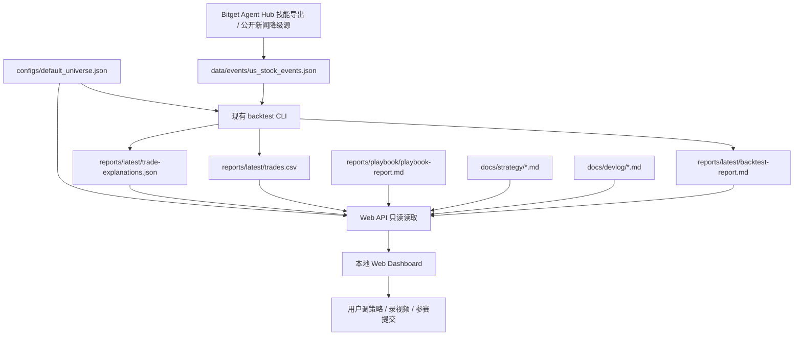

# Bitget 美股 AI 交易 Web 可视化参赛 Demo 需求文档

## 0. Skills 使用要求

本需求文档用于把“现有 Bitget 回测脚本”包装成可参赛、可演示、可解释的本地 Web Demo。进入实现前必须遵守：

1. `superpowers:brainstorming`
   - 先澄清参赛目标、页面展示、实现边界和安全边界。
   - 本文档确认前，不改业务代码、不新增真实交易能力。
2. `writing-requirements-docs`
   - 本阶段只写需求文档，需求确认后再拆实施计划。
3. `superpowers:writing-plans`
   - 只有用户确认本文档后，才进入实施计划。
4. `superpowers:verification-before-completion`
   - 交付前检查文档是否有占位符、歧义、遗漏验收标准和敏感信息。

## 1. 基本信息

- 需求名称：Bitget 美股 AI 交易 Web 可视化参赛 Demo
- 所属项目：`/Users/ada/Documents/bitget ai`
- 文档状态：待用户确认
- 需求来源：用户口述 + Bitget AI Base Camp Hackathon S1 官方规则 + 现有本地回测脚本
- 创建日期：2026-06-10
- 最近更新：2026-06-10

## 2. 背景

当前项目已经有两条能力：

1. 本地公开行情回测：
   - 入口：`PYTHONPATH=src python3 -m bitget_ai_backtest.cli backtest --config configs/default_universe.json --output-dir reports/latest`
   - 输出：`reports/latest/backtest-report.md` 和 `reports/latest/trades.csv`
   - 特点：不需要 API Key，不查账户，不下单，只用 Bitget 公开行情做本地模拟。
2. Bitget Playbook 官方回测：
   - 入口：`playbook-backtest`
   - 输出：`reports/playbook/playbook-report.md`
   - 特点：用 Playbook API Key 把策略包交给 Bitget 平台跑回测，不发布、不启用、不实盘。

现在的问题是：Markdown 和 CSV 对用户和评委都不够直观。用户希望通过一个本地 Web 端口页面，直接看到：

- 选了哪几支股票；
- 每只股票表现怎么样；
- 回测是怎么跑的；
- 策略什么时候买入、什么时候卖出；
- 买卖触发原因是什么；
- 哪些新闻、宏观、技术信号影响了判断；
- 最终如何满足比赛提交要求。

参考项目 `/Users/ada/Documents/daily_stock_analysis-main/` 可以借鉴它的本地 WebUI、FastAPI、前端静态页面、K 线图、股票表格和 API 喂数据思路。但本项目不能照搬成大型系统，本轮只做参赛最短路径。

## 3. 比赛参加要求整理

基于用户提供的 Bitget AI Base Camp Hackathon S1 规则，当前项目选择赛道三：美股 AI 交易。

### 3.1 时间线

| 节点 | 时间 |
| --- | --- |
| 活动时间 | 2026-05-27 至 2026-06-30 |
| 报名截止 | 2026-06-14 24:00 UTC+8 |
| 提交窗口 | 2026-06-15 0:00 至 2026-06-25 24:00 UTC+8 |
| 评审 | 2026-06-25 至 2026-06-29 |
| 颁奖 | 2026-06-30 |

### 3.2 美股 AI 交易赛道提交材料

| 材料 | 是否必填 | 本项目最短路径 |
| --- | --- | --- |
| Demo 链接 或 GitHub 仓库 | 二选一必填 | 优先提交 GitHub 仓库；如时间允许，再提供本地 Web Demo 录屏或公开部署 Demo |
| 项目说明 | 必填 | 准备 200 字以内说明：解决什么问题、使用了哪些 Bitget 工具、有何回测证据 |
| 视频演示 | 选填 | 推荐录 3 分钟以内视频，展示 Web 页面、股票池、买卖点、回测指标和 Playbook 结果 |
| 传播帖子 | 所有赛道要求 | 转发 Bitget 官方互动帖，并发布项目介绍，带 `#BitgetHackathon` 和 `@Bitget AI` 官号 |
| 开发日记 / Showcase | 争取优秀参与奖 | 用 Web 页面截图、回测截图、README、开发日记草稿作为展示材料 |

### 3.3 评审关注点

本项目必须能说清楚：

1. 是否围绕美股代币化交易场景解决真实问题。
2. 是否有可验证的回测或模拟交易记录。
3. 是否用到了 Bitget 提供的美股相关数据或工具。
4. Demo 是否真实可运行。
5. 是否有可核查的使用记录，例如回测记录、API 调用记录、交易日志或模拟记录。

## 4. 目标

1. 做一个本地 Web 端口页面，让用户和评委直观看懂当前回测脚本跑了什么。
2. 页面基于现有脚本和报告，不大改核心策略、不重写回测引擎。
3. 页面展示股票池、回测参数、每只股票表现、买卖点、触发原因和策略说明。
4. 页面能辅助录制 3 分钟以内演示视频。
5. README 能给出最短运行口令，让评委或用户低成本复现。
6. 保留 Bitget Playbook 官方回测结果作为比赛可信证据。

## 5. 非目标

1. 本轮不做实盘交易。
2. 本轮不做自动下单、自动调仓、自动发布 Playbook 策略。
3. 本轮不读取账户余额、持仓、订单或资金信息。
4. 本轮不接入完整 Bitget Agent Hub 交易 API。
5. 本轮不自建新闻爬虫和新闻数据库。
6. 本轮不做登录系统、权限系统、多用户系统。
7. 本轮不做复杂部署平台；优先本地端口可运行。
8. 本轮不照搬 `daily_stock_analysis-main` 的大型架构，只借鉴必要页面和 API 思路。

## 6. 使用场景

| 场景 | 使用者 | 触发条件 | 预期结果 |
| --- | --- | --- | --- |
| 本地调策略 | 用户 | 用户想知道为什么亏、为什么买卖频繁 | 打开 Web 页面，看股票列表、买卖点、触发原因和策略说明 |
| 参赛展示 | 用户 / 评委 | 需要证明项目真实可运行 | 页面展示本地回测结果、Playbook 回测结果和 GitHub 运行方式 |
| 录制视频 | 用户 | 准备 3 分钟以内演示视频 | 按页面从上到下讲：问题、股票池、策略、买卖点、结果、Bitget 工具 |
| 调整股票池 | 用户 | 想改跑哪些股票 | 修改 `configs/default_universe.json` 后重新回测，页面展示新股票池 |
| 调整策略口径 | 用户 / Codex | 想降低交易频率或改买卖条件 | 页面先暴露当前触发原因，后续再单独写策略调整需求 |

## 7. 功能范围

### 7.1 必须实现

1. 本地 Web 端口启动入口。
   - 推荐命令形态：`PYTHONPATH=src python3 -m bitget_ai_backtest.cli web --config configs/default_universe.json --output-dir reports/latest --port 8000`
   - 具体命令以实施计划确认为准。
2. Web 首页展示项目状态。
   - 本地回测是否已生成；
   - Playbook 回测报告是否存在；
   - 当前是否只是回测/展示模式；
   - 明确写出“不下单、不查账户、不实盘”。
3. 股票池展示。
   - 从 `configs/default_universe.json` 读取当前 symbols；
   - 展示 `NVDAUSDT`、`MSFTUSDT`、`GOOGLUSDT`、`AMDUSDT`、`METAUSDT` 等当前实际运行标的；
   - 展示周期、K 线数量、本金、单次交易比例、手续费、宏观模式、新闻倾向。
4. 回测结果总览。
   - 展示每只股票的最终权益、收益率、最大回撤、最后观点、交易次数；
   - 数据来源优先复用 `reports/latest/backtest-report.md` 或由现有回测结果结构生成。
5. 股票详情页或详情面板。
   - 点击某只股票后，展示该股票价格走势；
   - 展示买入点和卖出点；
   - 展示每次交易价格、数量、手续费、方向和触发观点。
6. 策略解释区。
   - 用中文大白话展示当前策略：
     - 趋势向上 + 动量为正时加分；
     - 趋势向下 + 动量为负时减分；
     - 新闻偏利好加分，新闻偏利空减分；
     - 宏观 risk-on 加分，risk-off 减分；
     - RSI 过热降分，超跌反弹加分；
     - 分数高买入，分数低卖出，中间观望。
   - 展示五档观点：看多、谨慎看多、中性观望、谨慎看空、看空。
7. 触发原因展示。
   - 对每次买入/卖出显示“为什么触发”；
   - 第一版至少展示现有 `reason/view`，例如 `cautiously_bullish`、`bearish`；
   - 如果实现成本可控，进一步展示 `trend_up`、`trend_down`、`news_neutral`、`macro_neutral` 等更细原因。
8. 新闻/事件展示。
   - 页面必须有“新闻与事件信号”区块；
   - 第一版优先读取 Bitget Agent Hub 技能导出的新闻/宏观/情绪/技术事件，尤其是 `news-briefing`；
   - 支持的 Bitget 技能来源包括 `news-briefing`、`macro-analyst`、`sentiment-analyst`、`technical-analysis`、`market-intel`；
   - 如果 Bitget 技能暂不可用或没有历史事件数据，再降级公开免费新闻源；
   - 每条事件必须显示来源类型、发布时间、标题、URL、情绪判断和判断原因；
   - `news_bias` 只作为无事件文件时的降级配置，不允许把模拟新闻写成真实新闻。
9. Playbook 官方回测结果展示。
   - 读取 `reports/playbook/playbook-report.md`；
   - 展示状态、收益、回撤、胜率、交易次数；
   - 明确说明这是 Bitget Playbook 官方回测记录，不是实盘交易。
10. 参赛材料区。
    - 列出 GitHub 仓库、项目说明、3 分钟视频、传播帖子、开发日记需要准备什么；
    - 可以复用 `docs/devlog/showcase-checklist.md` 和 `docs/devlog/submission-summary-200chars.md`。
11. README 运行说明。
    - 增加本地 Web Demo 的启动命令；
    - 增加页面地址，例如 `http://127.0.0.1:8000`；
    - 增加“先跑回测，再打开页面”的最短流程。

### 7.2 可以后置

1. 页面上直接编辑股票池并保存配置。
2. 页面上直接修改策略参数。
3. 真实接入 Bitget Agent Hub `news-briefing` 新闻列表。
4. 多策略版本对比。
5. SQLite 数据库存历史运行记录。
6. 一键导出演示视频素材。
7. 公开部署 Demo 链接。
8. 自动生成 X/Twitter 开发日记。

### 7.3 明确禁止

1. 禁止 Web 页面读取或显示 `.env` 中的真实 API Key。
2. 禁止页面提供实盘下单按钮。
3. 禁止自动发布、启用或订阅 Playbook 策略。
4. 禁止启动后台定时任务或守护进程。
5. 禁止为了展示效果伪造收益、伪造新闻、伪造 API 调用记录。
6. 禁止把未实现的 Agent Hub 新闻能力写成已经实现。

## 8. 输入与输出

### 8.1 输入

| 输入项 | 来源 | 格式 | 是否必填 | 说明 |
| --- | --- | --- | --- | --- |
| 股票池配置 | `configs/default_universe.json` | JSON | 是 | 当前回测跑哪些 Bitget 股票类 USDT 永续合约 |
| 新闻/事件记录 | `data/events/us_stock_events.json` | JSON | 否 | 由 Bitget 技能导出或公开新闻源生成的真实事件表 |
| 本地回测报告 | `reports/latest/backtest-report.md` | Markdown | 是 | 展示总览指标 |
| 本地交易记录 | `reports/latest/trades.csv` | CSV | 是 | 展示买入卖出点和交易明细 |
| 交易解释记录 | `reports/latest/trade-explanations.json` | JSON | 否 | 展示每笔交易匹配到的新闻/事件和解释链 |
| Playbook 回测报告 | `reports/playbook/playbook-report.md` | Markdown | 否 | 展示 Bitget 官方回测证据 |
| 策略说明文档 | `docs/strategy/*.md` | Markdown | 否 | 页面可引用策略解释 |
| 参赛材料文档 | `docs/devlog/*.md` | Markdown | 否 | 页面可引用提交 checklist 和项目简介 |

### 8.2 输出

| 输出项 | 去向 | 格式 | 成功标准 |
| --- | --- | --- | --- |
| 本地 Web 页面 | 浏览器 | HTML/CSS/JS | 打开本地端口能看到股票池、策略、回测结果和交易明细 |
| 本地 API | 浏览器页面 | JSON | 页面能拿到 summary、symbols、trades、strategy、playbook、submission checklist |
| 新闻/事件文件 | `data/events/us_stock_events.json` | JSON | 每条事件有来源、发布时间、标的、标题、情绪和判断原因 |
| 交易解释文件 | `reports/latest/trade-explanations.json` | JSON | 每笔交易能追溯 24 小时内的匹配事件或明确显示无匹配事件 |
| README 运行说明 | `README.md` | Markdown | 用户能复制命令启动 Web Demo |
| 需求追踪记录 | 本文档或实施计划 | Markdown | 每条需求能对应实现位置和验证方式 |

## 9. 推荐页面结构

第一版页面建议是单页应用或单页 Dashboard，不做复杂多页面系统。

```text
┌──────────────────────────────────────────────┐
│ 顶部：Bitget 美股 AI 交易 Demo 状态           │
│ 回测模式 / 不下单 / GitHub 可复现 / Playbook  │
├──────────────────────────────────────────────┤
│ 区块 1：参赛最短路径                          │
│ 赛道、提交材料、当前完成度、还缺什么           │
├──────────────────────────────────────────────┤
│ 区块 2：当前股票池与回测配置                  │
│ NVDAUSDT / MSFTUSDT / GOOGLUSDT / AMDUSDT... │
├──────────────────────────────────────────────┤
│ 区块 3：回测总览表                            │
│ 收益、回撤、交易次数、最后观点                │
├──────────────────────────────────────────────┤
│ 区块 4：单只股票详情                          │
│ K 线 / 价格走势 / 买入点 / 卖出点             │
├──────────────────────────────────────────────┤
│ 区块 5：这次为什么买/卖                       │
│ 趋势、新闻、宏观、RSI、最终观点               │
├──────────────────────────────────────────────┤
│ 区块 6：Playbook 官方回测记录                 │
│ status、return、drawdown、win rate、trades    │
├──────────────────────────────────────────────┤
│ 区块 7：提交材料 checklist                    │
│ GitHub / 200字说明 / 3分钟视频 / 发帖链接      │
└──────────────────────────────────────────────┘
```

## 10. 推荐技术方案

### 10.1 推荐方案：轻量 FastAPI + 静态前端页面

借鉴 `daily_stock_analysis-main` 的 WebUI 思路，但压缩到最小：

```text
现有 CLI / 回测模块
-> 新增只读 Web API
-> 静态 HTML/JS 页面
-> 浏览器查看 Dashboard
```

优点：

- 本地端口展示直观，适合录视频；
- 后端可以复用现有 Python 回测逻辑；
- 不需要复杂部署；
- 不需要读取真实账户或 API Key；
- 后续如果要增强成正式 Demo，也有清晰扩展口。

代价：

- 需要新增少量 Web 入口和页面文件；
- 如果要 K 线交互图，需要引入轻量前端图表库或用简化图表。

### 10.2 备选方案：纯静态 HTML 报告

```text
回测脚本
-> 生成一个 reports/latest/index.html
-> 浏览器直接打开
```

优点：

- 实现最简单；
- 不需要端口；
- 不需要 Web 后端。

缺点：

- 不像一个真实可运行 Demo；
- 不方便点击切股票；
- 展示和交互能力较弱。

### 10.3 备选方案：复制 daily_stock_analysis-main 的完整 Web 栈

```text
FastAPI + React/Vite + 多页面导航 + 完整构建流程
```

优点：

- 产品感最好；
- 后续扩展能力最强。

缺点：

- 对当前比赛最短路径来说太重；
- 容易把时间花在工程复杂度上；
- 会偏离“基于现有脚本，不大改”的目标。

### 10.4 本文档推荐

推荐采用 `10.1 轻量 FastAPI + 静态前端页面`。

理由：它比纯 Markdown/CSV 更像 Demo，比完整 React/Vite 系统更轻，最符合当前目标：快速参赛、能看懂、能录视频、少改脚本。

## 11. 数据流



## 12. 目录与文件约束

### 12.1 允许新增或修改

| 路径 | 说明 |
| --- | --- |
| `docs/requirements/2026-06-10-bitget-web-demo-showcase.md` | 本需求文档 |
| `README.md` | 后续实现后补 Web Demo 运行说明 |
| `src/bitget_ai_backtest/` | 后续实现 Web API / 数据读取 / 页面服务 |
| `tests/` | 后续实现对应测试 |
| `static/` 或 `web/` | 后续实现静态页面资源，具体路径由实施计划确定 |
| `data/events/` | 后续保存脱敏新闻/事件记录，不保存密钥或账户信息 |
| `docs/devlog/` | 后续补参赛说明和录屏脚本 |

### 12.2 禁止修改或禁止提交

| 路径 / 内容 | 约束 |
| --- | --- |
| `.env` | 禁止读取、打印、提交真实密钥 |
| `reports/playbook/*.json` | 保持忽略，不提交原始 API 响应 |
| 真实账户、持仓、订单数据 | 禁止接入本轮页面 |
| 实盘下单逻辑 | 禁止新增 |
| 后台定时任务 | 禁止新增 |

## 13. 安全边界

1. Web 页面只能展示回测和文档信息。
2. Web 页面不得显示真实 API Key、secret、passphrase、账户 ID、余额、持仓、订单。
3. Web API 必须是只读接口。
4. 页面必须明确提示：当前为 backtest-only demo。
5. 如果未来要接真实新闻、Agent Hub、通知或定时任务，必须另写需求文档。
6. 如果未来要实盘下单，必须另写交易执行需求、风控需求、dry-run 验证和人工确认流程。

## 14. 错误处理要求

| 错误 | 页面表现 | 后端要求 |
| --- | --- | --- |
| 没有跑过本地回测 | 页面提示先运行 backtest 命令 | 不崩溃，返回明确错误 |
| `trades.csv` 缺失 | 交易明细区提示暂无交易记录 | 不伪造交易 |
| Playbook 报告缺失 | Playbook 区块显示未运行 | 不阻塞本地页面 |
| 新闻/事件文件缺失 | 新闻区提示未生成事件文件，交易解释显示无匹配事件 | 不伪造新闻，不把 `news_bias` 当真实新闻 |
| 配置文件格式错误 | 页面提示配置读取失败 | 返回可读错误 |
| 图表数据不足 | 显示空状态 | 不报前端白屏 |

## 15. 验收标准

| 编号 | 验收项 | 验收方式 | 通过标准 |
| --- | --- | --- | --- |
| AC-1 | 能启动本地 Web Demo | 运行 README 中的启动命令 | 浏览器打开本地端口能看到页面 |
| AC-2 | 展示实际股票池 | 页面人工检查 | 页面列出的 symbols 与 `configs/default_universe.json` 一致 |
| AC-3 | 展示本地回测结果 | 页面人工检查 + 文件对比 | 页面收益、回撤、交易次数与 `reports/latest/backtest-report.md` 一致 |
| AC-4 | 展示买卖明细 | 页面人工检查 + CSV 对比 | 页面交易方向、价格、手续费、原因来自 `reports/latest/trades.csv` |
| AC-5 | 展示策略解释 | 页面人工检查 | 用户能看懂当前策略如何从趋势/新闻/宏观/RSI 得到买卖观点 |
| AC-6 | 展示 Playbook 回测结果 | 页面人工检查 | 如果 `reports/playbook/playbook-report.md` 存在，页面展示 status 和核心指标 |
| AC-7 | 安全边界明确 | 页面人工检查 + 代码检查 | 页面不展示密钥、不提供下单按钮、不查账户 |
| AC-8 | 参赛材料清楚 | 页面人工检查 | 页面列出 GitHub、200 字说明、3 分钟视频、传播帖子、开发日记要求 |
| AC-9 | 测试通过 | 运行测试命令 | 现有测试通过，新增 Web 数据读取测试通过 |
| AC-10 | 无敏感信息泄漏 | 搜索检查 | 仓库不包含真实 API Key、secret、passphrase |
| AC-11 | 新闻/事件可落盘 | 运行 `fetch-events` | 生成 `data/events/us_stock_events.json`，每条事件有 `source_type` |
| AC-12 | 交易解释链可落盘 | 运行带 `--events` 的 backtest | 生成 `reports/latest/trade-explanations.json`，只匹配交易前 24 小时内事件 |

## 16. 参赛最短路径

本项目建议按下面顺序完成参赛：

1. 跑通本地回测，生成 `reports/latest/`。
2. 跑通 Playbook 官方回测，生成 `reports/playbook/playbook-report.md`。
3. 做本地 Web Demo 页面，展示股票池、策略、买卖点和回测结果。
4. 更新 README，写明一键运行口令。
5. 准备 200 字以内项目说明。
6. 准备开发日记和传播帖子。
7. 录制不超过 3 分钟视频，优先展示 Web 页面。
8. 提交 GitHub 仓库；如果有时间，再补公开 Demo 链接。

## 17. 需求追踪表

| 需求 | 实现位置 | 验证方式 | 当前状态 |
| --- | --- | --- | --- |
| 展示股票池 | 后续 Web API + 页面 | 对比 `configs/default_universe.json` | 待实现 |
| 展示回测总览 | 后续 Web API + 页面 | 对比 `backtest-report.md` | 待实现 |
| 展示买卖明细 | 后续 Web API + 页面 | 对比 `trades.csv` | 待实现 |
| 展示策略解释 | 后续页面文案 + 策略元数据 | 人工检查 | 待实现 |
| 展示新闻/事件信号 | Bitget 技能导出优先，公开新闻源降级，输出 `data/events/us_stock_events.json` | 检查事件来源、发布时间和情绪原因 | 待实现 |
| 展示交易解释链 | `reports/latest/trade-explanations.json` + 页面 | 检查交易前 24 小时事件匹配 | 待实现 |
| 展示 Playbook 回测 | 后续 Web API + 页面 | 对比 `playbook-report.md` | 待实现 |
| 展示参赛 checklist | 后续页面 | 对比比赛要求和 docs/devlog | 待实现 |
| 不接实盘不泄密 | Web API / 页面 / README | 代码检查 + 敏感信息扫描 | 待实现 |

## 18. 待确认问题

以下问题会影响实施计划，但不阻塞本文档作为第一版草案：

1. 第一版页面是否只做单页 Dashboard，而不做多页面导航？
2. 第一版 K 线图是否允许先做简化价格折线图，后续再升级为专业 K 线？
3. 新闻/事件区第一版是否接受“配置化 news_bias + 说明真实 news-briefing 后置”，不伪装成真实新闻？
4. Web 端口默认是否使用 `8000`，如果被占用再换端口？
5. 参赛提交是否优先 GitHub 仓库，Demo 链接作为可选项？

## 19. 实施计划入口

用户确认本文档后，再生成实施计划。实施计划必须说明：

1. 准备新增 / 修改哪些文件；
2. 每个文件负责什么；
3. 如何复用现有 backtest 逻辑；
4. 如何读取报告和交易记录；
5. Web 端口怎么启动和停止；
6. 如何验证页面展示和源文件一致；
7. 如何证明没有实盘、没有密钥泄漏、没有后台任务。

## 20. 文档自检清单

- [x] 没有真实密钥、token、私钥或账户敏感信息
- [x] 目标和非目标没有互相冲突
- [x] 功能范围可以被实施计划直接引用
- [x] 输入、输出和验收标准能对应起来
- [x] 允许修改路径和禁止修改路径明确
- [x] 安全边界明确写入
- [x] 待确认问题不会阻塞草案评审
